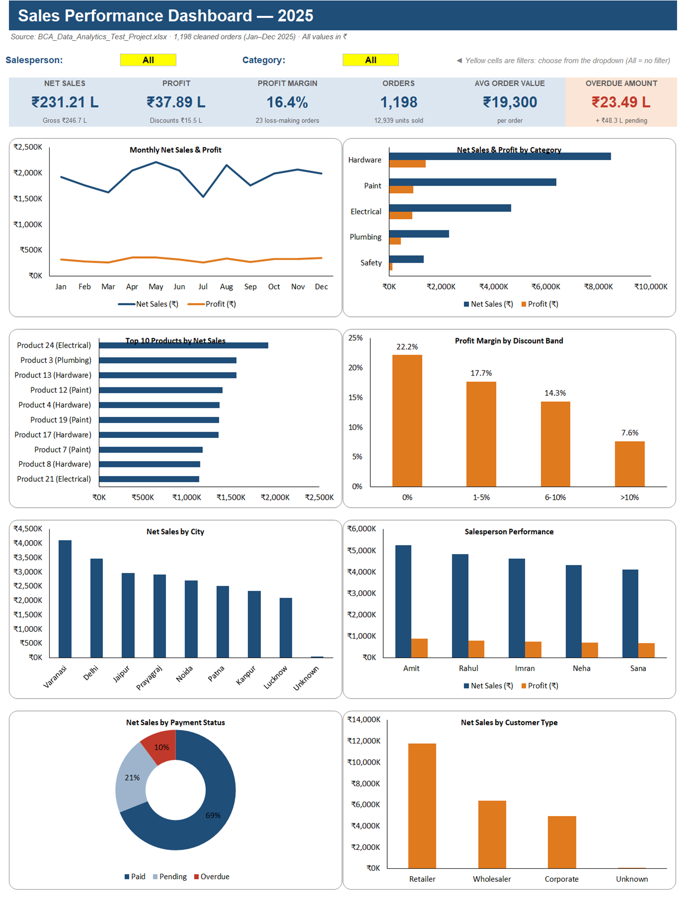
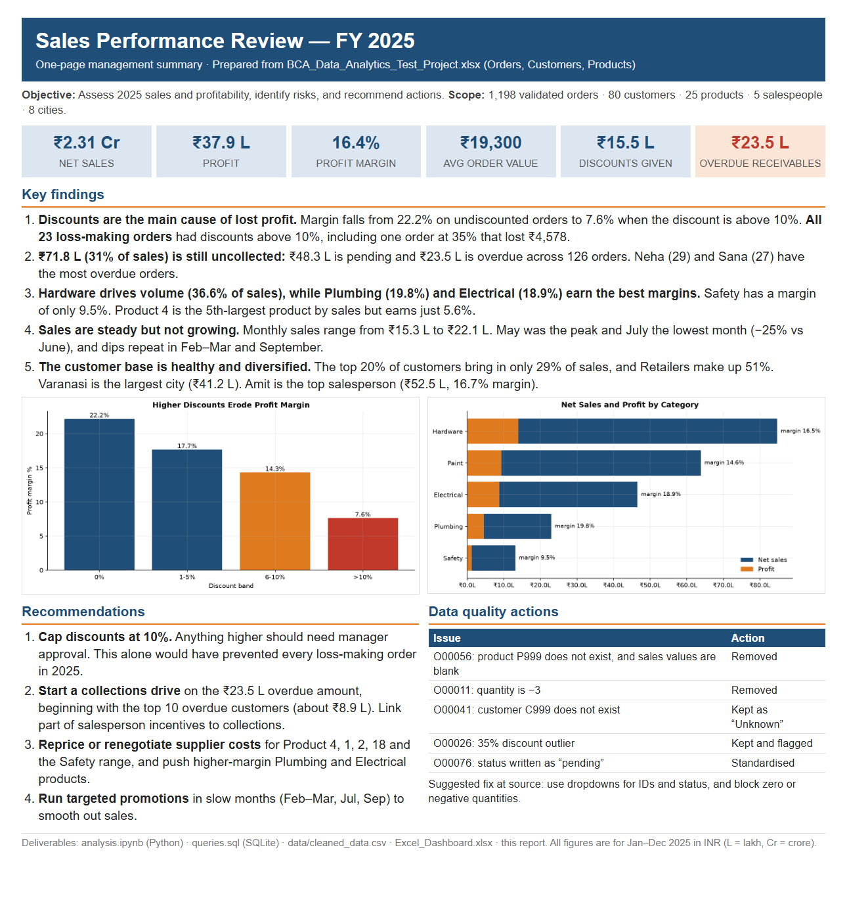

# Sales Performance Analysis

An end-to-end analysis of one year of B2B sales (1,200 orders, 80 customers, 25 products). It covers data cleaning and validation in Python, business questions answered in SQL, an interactive Excel dashboard, and a one-page report for management.


**Headline finding:** every one of the 23 loss-making orders had a discount above 10%. Profit margin falls from **22.2%** on undiscounted orders to **7.6%** once discounts go above 10%.

---

## Dashboard



The dashboard is driven by formulas. Choosing a **Salesperson** or **Category** from the yellow dropdowns updates every KPI and all 8 charts.

---

## Business questions

1. How much did we sell and earn in 2025, and what was the trend month by month?
2. Which categories and products drive revenue, and which have weak margins?
3. How do cities, customer types and salespeople compare?
4. How much money is still to be collected (pending or overdue)?
5. How do discounts affect profitability?

## Key insights

| Metric | Value |
|---|---|
| Net sales | ₹2.31 Cr |
| Profit | ₹37.9 L (16.4% margin) |
| Discounts given | ₹15.5 L (6.3% of gross sales) |
| Uncollected sales | ₹71.8 L (31% of sales), of which ₹23.5 L is overdue |

- **Discounts are the main cause of lost profit.** Discount % and margin % have a correlation of −0.53. All loss-making orders had discounts above 10%, and the average discount on those orders was 15.9%, compared with 6.2% overall.
- **Hardware brings in the most revenue** (36.6% of sales). **Plumbing (19.8%) and Electrical (18.9%) have the best margins.** Safety earns only 9.5%.
- **Product 4 is a hidden problem.** It is the 5th-largest product by sales but earns only a 5.6% margin.
- **Receivables are a risk.** 31% of sales has not been collected yet, and overdue amounts are spread across many customers.
- **Sales are stable but not growing.** Monthly sales stay between ₹15–22 L, with dips in Feb–Mar, July and September.
- **The customer base is diversified.** The top 20% of customers account for only 29% of sales.

## Recommendations

1. Require manager approval for any discount above 10%.
2. Run a collections drive on the ₹23.5 L overdue amount, and link part of salesperson incentives to collections.
3. Revisit pricing or supplier costs for low-margin products (4, 1, 2, 18) and for the Safety category.
4. Plan promotions for the slow months.

---

## Data cleaning

The raw data had several deliberate quality problems. Each one was found with a check, fixed, and recorded:

| Issue | Order | Action |
|---|---|---|
| Product `P999` is not in the product master, and its price and sales fields are blank | O00056 | Removed |
| Quantity is `-3` | O00011 | Removed |
| Customer `C999` is not in the customer master | O00041 | Kept, with customer set to `Unknown` (the sales values are valid) |
| Discount of 35%, while every other order is 0–20% | O00026 | Kept and flagged as an outlier |
| Payment status written as `pending` instead of `Pending` | O00076 | Standardised |

Result: **1,200 → 1,198 orders**. Every calculated column (gross, net, cost and profit) was re-checked against quantity × price and found to be consistent.

---

## SQL

[`queries.sql`](queries.sql) has 20 queries grouped into data-quality checks, KPIs, product, customer, salesperson and payment analysis. They use joins, CTEs, `CASE` and window functions (`LAG`, `RANK`). Example:

```sql
-- Best-selling product within each category
SELECT category, product_name, net_sales
FROM (
    SELECT p.category, p.product_name,
           ROUND(SUM(o.net_sales), 2) AS net_sales,
           RANK() OVER (PARTITION BY p.category ORDER BY SUM(o.net_sales) DESC) AS rnk
    FROM orders o
    JOIN products p ON o.product_id = p.product_id
    GROUP BY p.category, p.product_name
)
WHERE rnk = 1;
```

---

## Management report

A one-page summary written for non-technical readers: [`Management_Report.pdf`](Management_Report.pdf)



---

## Project structure

```text
├── analysis.ipynb            # Python: cleaning, validation, EDA, charts
├── analysis.py               # Same analysis as a plain script
├── queries.sql               # 20 SQL queries (SQLite)
├── Excel_Dashboard.xlsx      # Interactive dashboard
├── Management_Report.pdf     # One-page summary for management
├── data/
│   ├── BCA_Data_Analytics_Test_Project.xlsx   # Raw input (Orders, Customers, Products)
│   ├── cleaned_data.csv                       # Cleaned, merged dataset
│   ├── cleaned_data.xlsx                      # Cleaned data + master tables + data-quality log
│   └── sales.db                               # SQLite database used by queries.sql
├── charts/                   # Charts exported by the notebook
├── images/                   # README screenshots
└── report_src/               # HTML source of the report
```text

## How to run

```bash
pip install pandas openpyxl matplotlib jupyter
jupyter notebook analysis.ipynb        # Run All: rebuilds data/cleaned_data.*, data/sales.db and charts/
sqlite3 data/sales.db < queries.sql    # or open sales.db in DB Browser for SQLite
```

---

**Author:** [Mobasshir Rahman](https://github.com/TheMobasshirRahman)
